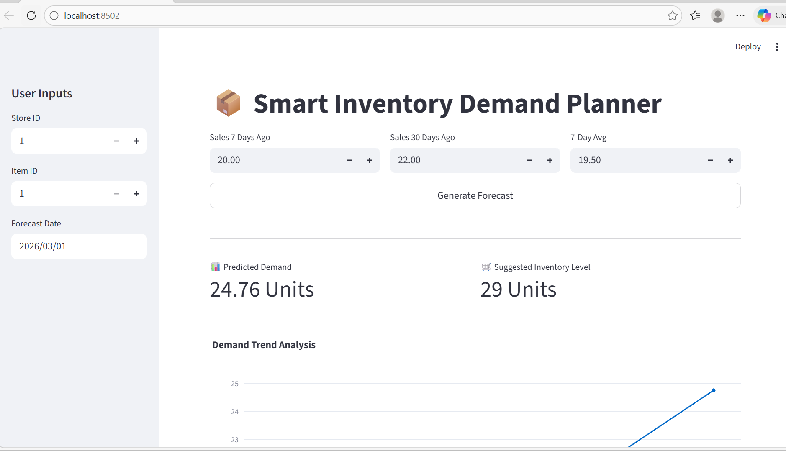
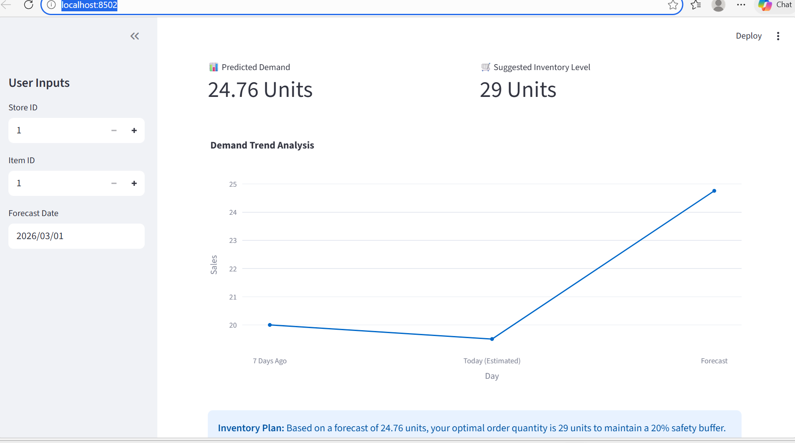

### Intelligent Inventory Demand Forecasting

### Main Interface

### Demand Forecast Analysis

## 🚀 Features
* **Real-time Predictions:** Uses a trained XGBoost model to forecast sales.
* **Interactive Dashboard:** Built with Streamlit for easy data input and visualization.
* **FastAPI Backend:** A robust API that serves model predictions on port 8001.
* **Trend Analysis:** Visualizes historical vs. forecasted data using Plotly.

